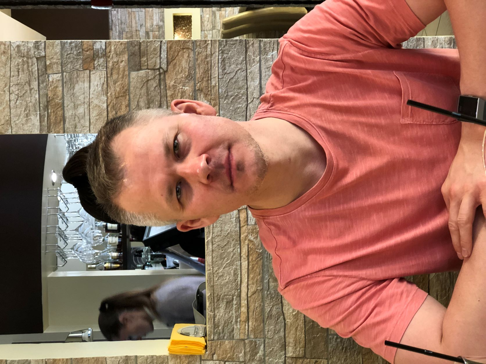

# Ильдар Зиннатуллин

Я начинающий фронтенд разработчик. 
Живу в г. Ижевске, женат, есть дочь. 
Имею высшее техническое образование. 
На сегодняшний момент прохожу профессиональную переподготовку 
в Нетологии по курсу "Програмист на JavaScript".

## Soft Skills
* Опыт работы на руководящих должностях
* Опыт работы с технологическими производственными процессами
* Декомпозиция задач
* Умение работать в команде
* Тайм-менеджмент

## Hard Skills
* Основы веб-дизайна, UI/UX
* HTML5, CSS3
* JavaScript
* Git, GitHub

## Намерен учить в ближайшее время
* React
* Node.js

